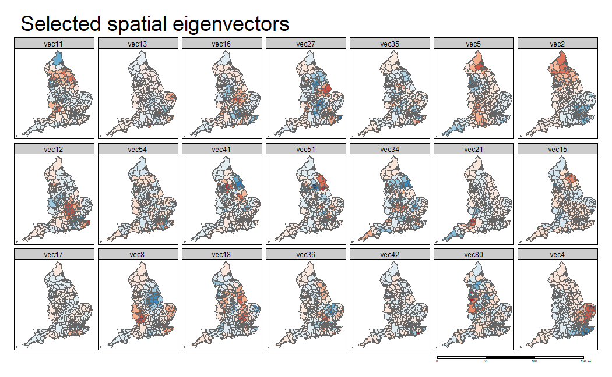

# Spatial Eigenvector Mapping (SEVM) – Brexit Vote Analysis

This project analyzes spatial patterns in the Brexit "Leave" vote share across England using **Spatial Eigenvector Mapping (SEVM)** in R.

## 📁 Data
- `brexit.shp` (not included in this repo — see note below)
- Predictors used: `prop_65_ov`, `prop_no_qu`, `prop_non_w`

> **Note:** The Brexit shapefile is not included due to size/licensing.
> Place your own copy in `data/brexit.shp` before running `analysis.Rmd`

## 🧰 R Packages
`sf`, `spdep`, `sp`, `tmap`, `ggplot2`, `gstat`, `dplyr`, `spatialreg`, `tripack`

## 🔍 Analysis Steps

1. **Spatial weights matrix**  
   Built from a combination of polygon contiguity (`poly2nb`) and k-nearest-neighbor (`k=1`), symmetrized and inverse-distance weighted.

2. **Baseline GLM (non-spatial)**  
   Quasi-Poisson GLM: `Leave ~ prop_65_ov + prop_no_qu + prop_non_w`, offset by `log(Valid_Vote)`.  
   → Explained deviance: **65.5 %**, strong residual spatial autocorrelation (Moran's I ≈ 0.48).

3. **SEVM model**  
   Candidate eigenvectors selected via `spatialreg::ME()` and added to the GLM.  
   → Explained deviance improved to **84.6 %**, residual spatial autocorrelation dropped to Moran's I ≈ 0.12.

   

4. **Combined eigenvector effect**  
   Coefficients multiplied by eigenvectors and back-transformed to the response scale to show the joint spatial effect.

   

5. **Spatially varying coefficients**  
   Interaction of `prop_no_qu` with the eigenvectors tested via `drop1()`; a reduced model kept significant interactions (`vec27`, `vec2`, `vec54`).  
   → Explained deviance rose slightly to **85.8 %**.

   

6. **Residual comparison**  
   Pearson residuals mapped for all three models (GLM, SEVM, SEVM with varying coefficients).

   

## 📊 Key Results

| Model | Explained Deviance | Residual Moran's I |
|---|---|---|
| Non-spatial GLM | 65.5 % | 0.48 (strong) |
| SEVM | 84.6 % | 0.12 (weak) |
| SEVM + varying coefficients | 85.8 % | further reduced |

## ✅ Conclusion
Adding spatial eigenvectors substantially improves model fit and removes most spatial autocorrelation in the residuals. Allowing the effect of "share unqualified" to vary spatially gives a small additional improvement and reveals regional differences in how education relates to the Leave vote.

